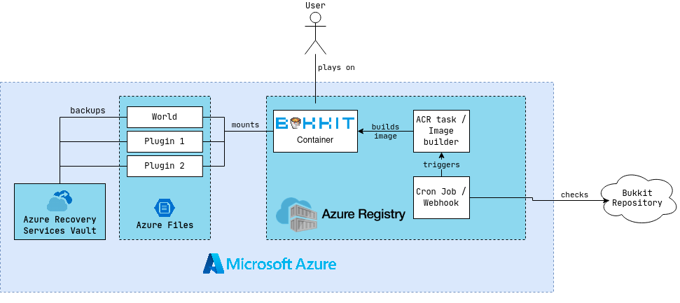

# CLC Project - Bukkit Server
## Summary
The goal is a fully automated Minecraft server running with Bukkit. The challenges faced are that Bukkit is not distributed as an executeable. 
Instead, only the source code is available and the software must be compiled each time a new release happens. Therefore, a webhook or cron job must monitor the codebase and trigger a buildjob which builds a new image whenever an update arrives.
This update must then be deployed to the running server instance without major service interruption.
Additional care has to be taken for plugins, these must also be kept updated without them being integrated into the image itself; plugins may create additional files which should not be lost when restarting or updating the Bukkit version.
Also, minecraft worlds should be persisted and a backup made regularly.

## What is Bukkit?
Bukkit is an community build, open source Minecraft server. It differs from the default Minecraft server in that it offers an API to develop plugins for the Minecraft server.
This allows people to alter gameplay on the server in ways not possible on the vanilla Minecraft server.
Additional administration plugins also make the lives of server operators easier.
The downside to the vanilla Minecraft server is that the Bukkit executable is not available to download to due a DCMA takedown. The server code however is available plus there are build tools offered by the developers to easily compile and deploy Bukkit.

## Architecture

### Building & Deployment
The aim of the project is to run every piece of architecture in Azure, starting by the Bukkit server itself to the build pipeline of the Bukkit executable.
Version changes in the Bukkit codebase should either be detected via webhooks or cron jobs, these should then trigger an Azure Container Registry task which builds and deploys the new image.

### Uptime Assurance
Bukkit servers tend to take time from startup until they are ready to accept connections from users.
Ideally, when an updated version of the server is spun up, the old one is kept online until the new one is ready to accept users.
This would keep downtime lower, although the disconnection from the server cannot be avoided. But most of the times version updates of Minecraft are not compatible to each other, meaning that users have to update their Minecraft version to continue playing on the server.
Another problem faced which needs research and remedy is the possibility of two servers using the same world volume, especially while users are online and possible altering the world.

### Volumes & Backups
As loosing all your progress with every server update becomes tedious with time, _Azure Files_ should be used to persist worlds throughout version updates.
Another important aspect of managing a Minecraft servers are backups. Backups can come in handy when hackers or griefers join the server and destroy the world, or wrong use of landscaping tools may leave the world uninhabitable.
Azure offers backups of _Azure Files_ via the _Recovery Services vault_.
